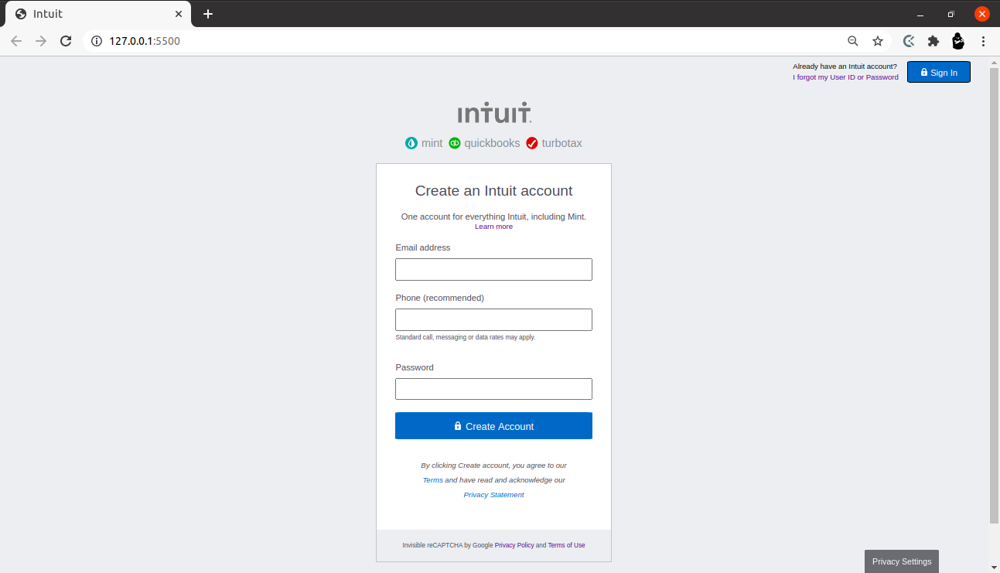

# Rashid-Godwin-HTML_Form

This is a project which focuses on clonig the account creation page of the so called webite "https://www.intuit.com".

# Mockup
[link to clone](https://accounts.intuit.com/signup.html?offering_id=Intuit.ifs.mint&namespace_id=50000026&redirect_url=https%3A%2F%2Fmint.intuit.com%2Foverview.event%3Ftask%3DS)

# Screenshot

Additional description about the project and its features.

## Built With

- Major languages - HTML & CSS
- Icons Used - mint.com website and google images . 

## Live Demo

[Live Demo Link](#)

## Getting Started

To get a local copy up and running follow these simple example steps.

### Prerequisites

- At least have a system with 4GB of RAM and 128 GB of free external memory.
- Be sure to download all the components.
- An IDE, ideally vscode or atom.

### Setup

- Clone this repo by using the extension.
- Download vscode.

### Install

- Install vscode.
- Install the live server extension in the vscode.

### Usage

- Open the folder where this project is cloned.

### Run tests

- Click the live server button that is placed on the bottom of the page.

### Deployment

It can be deployed on any server.

## Authors

👤 **Author1**

- Github: [@rashidmvk](https://github.com/rashidmvk)
- Twitter: [@rashidnm](https://twitter.com/rashidnm)
- Linkedin: [@rashidmvk](https://linkedin.com/in/rashidmvk)

👤 **Author2**

- Github: [@Gnwin](https://github.com/Gnwin)
- Twitter: [@gmarxr](https://twitter.com/gmarxr)
- Linkedin: [n-gwin](https://linkedin.com/in/n-gwin)

## 🤝 Contributing

Contributions, issues and feature requests are welcome!

Feel free to check the [issues page](https://github.com/rashidmvk/Rashid-Godwin-HTML_Form).

## Show your support

Give a ⭐️ if you like this project!

## Acknowledgments

- Thanks to Microverse for giving us this opportunity to work on this project.
- Hat tip to anyone whose code was used.
- Inspiration.
- etc.

## 📝 License

This project is [GR](lic.url) licensed.
